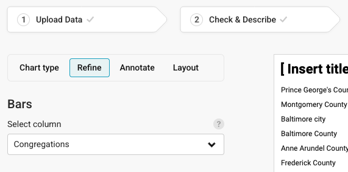
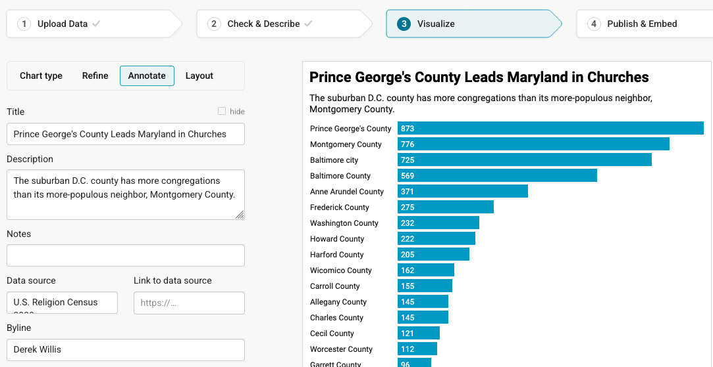
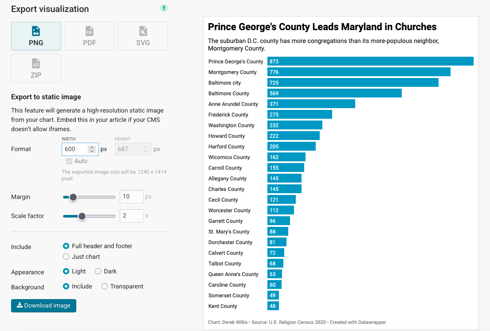
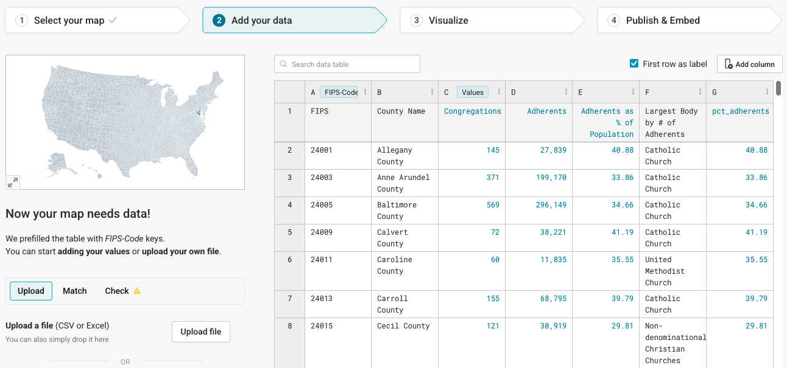
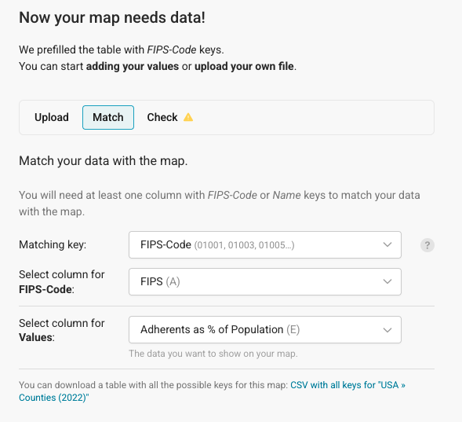

```{r setup, include=FALSE}
knitr::opts_chunk$set(echo = TRUE)
```

### Task 1: Load libraries and settings

**Task** Run the following code in the gray-colored codeblock below to load the tidyverse and janitor libraries.

```{r}
library(tidyverse)
library(janitor)
```

### Task 2: Get Maryland religion census data

First, let's get some data and work with it. We'll use county-level data from the U.S. Religion Census 2020 — a project that counts congregations and religious adherents across every U.S. county through denominational reporting. We've already filtered it to Maryland's 24 jurisdictions. Let's look at it.

**Task** Load the Maryland religion census CSV file.

```{r}
md_religion <- read_csv("data/md_religion_bar.csv")
```

### Task 3: Log into Datawrapper

**Task** Log into [datawrapper.de](https://www.datawrapper.de/). Once logged in, you'll click on New Chart.

```{r, echo=FALSE}
knitr::include_graphics("images/datawrapper1.png")
```

### Task 4: Upload the CSV File

The first thing we'll do is upload the religion CSV that's in the pre_lab_09/data folder.

**Task** Click on XLS/CSV and upload the `md_religion_bar.csv` file.

```{r, echo=FALSE}
knitr::include_graphics("images/datawrapper2.png")
```

### Task 5: Inspect the Data

Next up is to check and see what Datawrapper did with our data when we uploaded it. As you can see from the text on the left, if it's blue, it's a number. If it's green, it's a date. If it's black, it's text. Red means there's a problem. This data is very clean, so it should import without issues.

**Task** Look at the uploaded data, then click on the "Proceed" button.

```{r, echo=FALSE}
knitr::include_graphics(rep("images/datawrapper3.png"))
```

### Task 6: Make a Chart

Now we make a chart. Bar chart comes up by default, which is good, because with congregation totals, that's what we have.

**Task** Click on Refine. The first option we want to change is the column we're using for the bars — make sure it's set to "Congregations":

```{r, echo=FALSE}

```

Let's also choose to sort the bars so that the largest value appears first. We do that by clicking on the "Sort bars" button.

### Task 7: Annotate the Chart

Now we need to annotate our chart. Every chart needs a title, a source line and a credit line. Most need chatter (called `description` here).

**Task** Click on the "Annotate" tab to add the title and description. Really think about the title and description: the title is like a headline and the description provides some additional context. Another way to think about it: the title is the most important lesson from the graphic, and the description could be the next most important lesson or could provide more context to the title. The source is the U.S. Religion Census 2020.

```{r, echo=FALSE}

```

### Task 8: Publish the Chart

**Task** Click the "Publish & Embed" tab, then click on the "PNG" icon. Finally, click the "Download image" button and save that file in the pre_lab_09 folder.

```{r, echo=FALSE}

```

Some publication systems allow for the embedding of HTML into a post or a story. Some don't. The only way to know is to ask someone at your publication. Every publication system on the planet, though, can publish an image. So there's always a way to export your chart as a PNG file, which you can upload like any photo.

**Answer** Copy the url of the graphic you published here. It will begin with <https://datawrapper.dwcdn.net/>. Don't copy the browser's current url.

### Task 9: Make a Choropleth Map

Let's create a choropleth map — one that shows variations in religious adherence rates across Maryland counties. We'll read in the full county-level religion census data, which includes FIPS codes that Datawrapper needs to place each county on a map.

**Task** Run the following code to load the Maryland religion choropleth data.

```{r}
md_religion_county <- read_csv("data/md_religion_choropleth.csv")
```

In order to make a map, we need to tell Datawrapper that a certain column contains geographic information (besides the name of the county). The easiest way to do that for U.S. maps is to use something called a [FIPS Code](https://www.census.gov/programs-surveys/geography/guidance/geo-identifiers.html). You should read about them so you understand what they are, and think of them as a unique identifier for some geographical entity like a state or county. Our `md_religion_county` dataframe already has a FIPS code for each county.

Right now, the "Adherents as % of Population" column is stored as text with a percent sign (like `"40.88%"`). We need to convert it to a plain number so Datawrapper can use it to color the map.

**Task** Write code to create a new numeric column called `pct_adherents` from the "Adherents as % of Population" column, then write the dataframe back to the CSV file in the data folder.

```{r}
md_religion_county <- md_religion_county |>
  mutate(
    pct_adherents = as.numeric(str_remove(`Adherents as % of Population`, "%"))
  )

write_csv(md_religion_county, "data/md_religion_choropleth.csv")
```

**Task** Go back to Datawrapper and click on "New Map". Click on "Choropleth map" and then choose "USA >> Counties (2022)" for the map base and click the Proceed button.

**Task** Now we can upload the `md_religion_choropleth.csv` file from our data folder using the Upload File button. It should look like the following image:

```{r, echo=FALSE}

```

We'll need to make sure that Datawrapper understands what the data is and where the FIPS code is.

**Task** Click on the "Match" tab and make sure that yours looks like the image below (your column for adherents percentage may have a different name):

```{r, echo=FALSE}

```

**Task** Click the "Proceed" button (you should have to click it twice, since the first time it will tell you that there's no data for 3,210 counties — the rest of the U.S.). That will take you to the Visualize tab.

You'll see that the map currently shows the whole nation, and we only have Maryland data. Let's fix that.

**Task** Look for "Crop to data" under Appearance, and click the slider icon to enable that feature. You should see a map zoomed into Maryland with counties shaded in various colors. **Answer** Describe the changes from the previous map.

But it's a little rough visually, so let's clean that up.

**Task** Look for the "Show color legend" label and add a caption for the legend, which is the horizontal bar under the title. It represents the range of the data from the lowest adherence rate to the highest. Then click on the "Annotate" tab to add a title, description, data source and byline. The title should represent the headline, while the description should be a longer phrase that tells people what they are looking at. The source is the U.S. Religion Census 2020.

That's better, but check out the tooltip by hovering over a county. It's not super helpful. Let's change the tooltip behavior to show the county name and a better-formatted number.

**Task** Click the "Customize tooltips" button so it expands down. Change `{{ fips_code }}` to `{{ County Name }}` and change the adherents value to `{{ FORMAT(pct_adherents, "00.0%")}}`. **Answer** Describe the changes from the previous map.

**Task** Add a note that says that this data comes from denominational self-reporting and may undercount some faith traditions, and add an alternative description for screen readers — a simple sentence describing what your map shows. Experiment with the "Show labels" button, choosing the "by column" option for Type to display some or all of the county names.

Ok, that looks better. Let's publish!

**Task** Click the "Proceed" button until you get to the "Publish & Embed" tab, then click "Publish Now". Copy the published URL (like you did for the chart above) and paste it below. **Answer** Put the URL of your map here.
